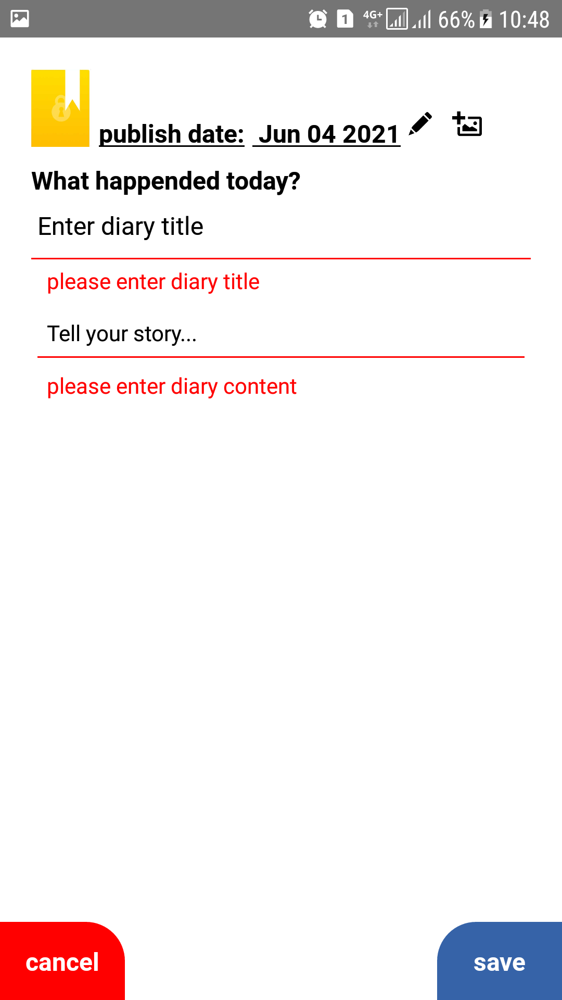

## for create react-native app:

  * npx react-native init Project-Name

## Now go into the project folder.
  * cd Project

## You can now run and build the app for your own operating system with the following command:

  * npx react-native run-android 

  * npx react-native run-ios

## after adding fonts to assets you have to do the following command:
  * npx react-native link
-----------------------------

## unable to load script. make sure you're either running a metro server (run 'react-native start')

## react native metro bundler not starting : Solved Solution

## create folder in root of android project:- ..\android\app\src\main\assets set folder name is assets

## command link:

* npx react-native bundle --platform android --dev false --entry-file index.js --bundle-output android/app/src/main/assets/index.android.bundle --assets-dest android/app/src/main/res

## show preview of readme in vscode press ctrl+shift+v

<!--  -->

